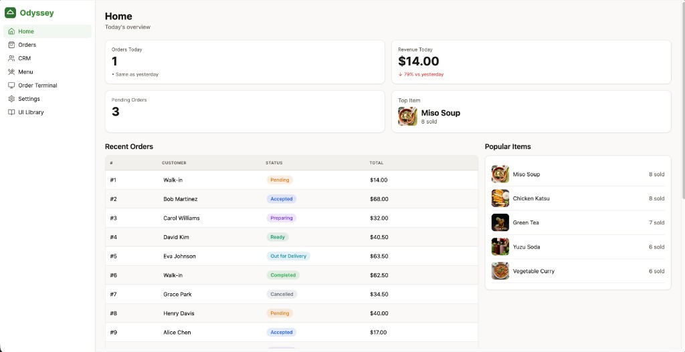
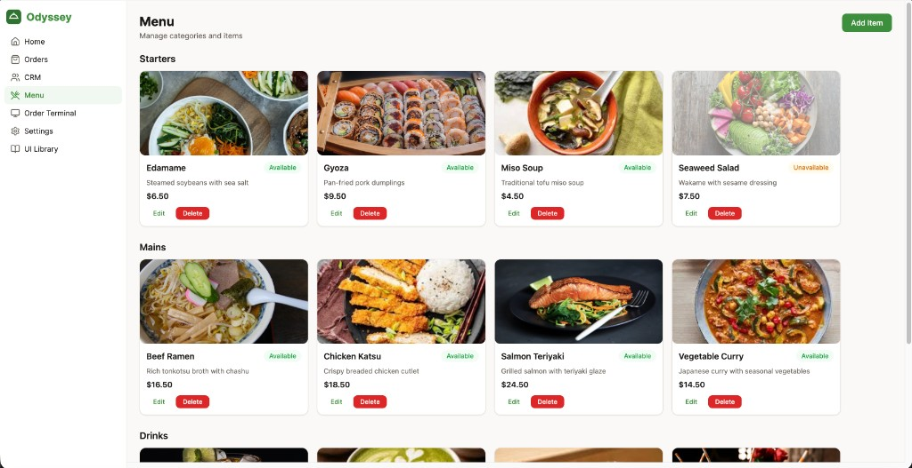
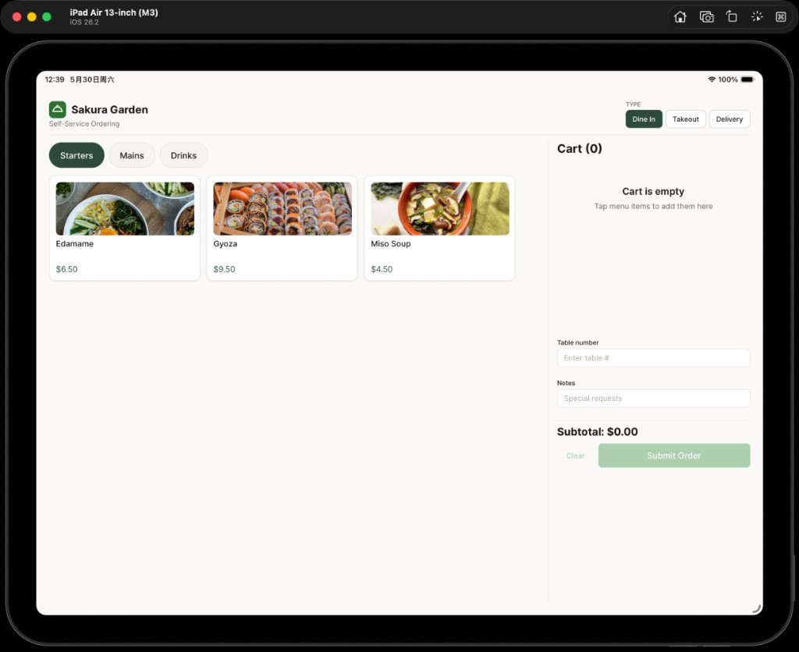

# Odyssey Restaurant

Fullstack restaurant operations product — POS ordering, staff dashboard, and backend API — built as a type-safe pnpm monorepo with an automated contract pipeline from Drizzle → OpenAPI → Orval.

**Repository:** https://github.com/spikedingo/odyssey-demo

## Screenshots

### Staff dashboard (Web)



*Home (`/home`) — today's overview, recent orders table, and popular items.*



*Menu (`/menu`) — manage categories and items with availability badges and edit/delete actions.*

### Order terminal (tablet)



*POS (`/`) on iPad — category tabs, menu grid, and cart sidebar.*

---

## What This Project Is

| Surface | Route | Purpose |
|---|---|---|
| **Order Terminal (POS)** | `/` | Customer-facing ordering UI — browse menu, build cart, submit orders |
| **Staff Dashboard** | `/home` | Operations dashboard — Home KPIs, Orders, CRM, Menu, Settings |
| **Design system showcase** | `/ui-library` | Tokens, primitives, and component states |

> **Important:** The app root (`/`) is the **POS ordering screen**, not the dashboard. Open **`/home`** to enter the staff dashboard (sidebar navigation: Home, Orders, CRM, Menu, Settings).

### Platform

One **Expo + Expo Router + React Native** app (`apps/dashboard`) ships:

| Target | Command | Notes |
|---|---|---|
| **Web (H5)** | `pnpm dev:dashboard` | React Native Web at http://localhost:8081 |
| **iOS** | `pnpm --filter=dashboard dev:ios` | Simulator or device via Expo Go / dev client |
| **Android** | `pnpm --filter=dashboard dev:android` | Emulator or device |

Layouts adapt by breakpoint: phone (top bar + drawer), tablet (icon rail + split POS), desktop (full sidebar).

---

## Stack

| Layer | Technology |
|---|---|
| Frontend | Expo 51 + React Native Web, Expo Router |
| Backend | Hono on Cloudflare Workers, Drizzle ORM, PostgreSQL |
| Contract | OpenAPI 3 + Orval-generated React Query hooks |
| UI | `@odyssey/ui` design system (tokens, theme, primitives) |
| Tooling | pnpm workspace, Turborepo, Vitest, Jest |

## Architecture

Single source of truth flows through generated contracts — no handwritten frontend DTOs:

```
Drizzle schema → drizzle-zod → Hono OpenAPI → openapi.json → Orval → @odyssey/api-client → apps/dashboard
```

**Rules enforced:**
- Persisted data truth starts in Drizzle schema (`services/backend/src/db/schema.ts`)
- API contracts are generated, not duplicated
- Frontend uses Orval-generated React Query hooks only
- Business logic lives in backend services and hooks, not large page components
- Design tokens centralized in `packages/ui`

---

## Prerequisites

- **Node.js** 20+
- **pnpm** 9+ (repo pins `9.15.0`; enable via Corepack)
- **Docker Desktop** for local Postgres **or** a [Neon](https://neon.tech) cloud Postgres instance

---

## Quick Start

### Option A — Agent Skill (recommended)

This repo includes an ops skill for automated bootstrap and troubleshooting.

After clone, in **Coding agent chat**:

> **Use odyssey-local-setup skill**

Or run the scripts directly:

```bash
pnpm setup:local    # install → env → db → migrate → seed → gen:contract
pnpm verify:local   # verify artifacts + seed data
pnpm dev:backend    # terminal 1 → http://localhost:8787
pnpm dev:dashboard  # terminal 2 → http://localhost:8081
```

Skill location: [`.cursor/skills/odyssey-local-setup/SKILL.md`](.cursor/skills/odyssey-local-setup/SKILL.md)

| Script | Purpose |
|---|---|
| `pnpm setup:local` | Full post-clone bootstrap |
| `pnpm verify:local` | Verify generated artifacts and seed data |
| `pnpm reset:local` | Reset to fresh-clone artifact state (stops DB, removes `node_modules`, `.env`, generated files) |

Detailed manual guide: [SETUP_FROM_CLONE.md](SETUP_FROM_CLONE.md)

### Option B — Manual setup

```bash
git clone https://github.com/spikedingo/odyssey-demo.git
cd odyssey-demo

pnpm install
cp services/backend/.env.example services/backend/.env
cp apps/dashboard/.env.example apps/dashboard/.env

pnpm db:up          # skip if using Neon — set DATABASE_URL in backend .env instead
pnpm db:migrate
pnpm seed
pnpm gen:contract   # required — generated client is gitignored

pnpm dev:backend    # terminal 1 → http://localhost:8787
pnpm dev:dashboard  # terminal 2 → http://localhost:8081
```

**Open in browser:**
- POS ordering: http://localhost:8081/
- Staff dashboard: http://localhost:8081/home

### First clone — run the app (iOS / Android / tablet)

The mobile app needs the **same backend + env setup** as web. Do this once after clone:

```bash
git clone https://github.com/spikedingo/odyssey-demo.git
cd odyssey-demo

# One-shot bootstrap (install, .env, Postgres, migrate, seed, API client)
pnpm setup:local
pnpm verify:local
```

Then use **two terminals**:

```bash
# Terminal 1 — API (required; POS loads menu from here)
pnpm dev:backend
```

```bash
# Terminal 2 — Expo dev server + native target
pnpm --filter=dashboard dev:ios      # Xcode Simulator or Expo Go on device
# or
pnpm --filter=dashboard dev:android  # Android emulator or device
```

From the Expo CLI you can also press **`i`** (iOS) / **`a`** (Android) after `pnpm dev:dashboard:native` (plain `expo start`).

**`apps/dashboard/.env`** (created from `.env.example` during setup):

| Variable | Simulator / emulator | Physical device on Wi‑Fi |
|---|---|---|
| `EXPO_PUBLIC_API_BASE_URL` | `http://localhost:8787` | `http://<your-lan-ip>:8787` (e.g. `http://192.168.1.10:8787`) |

`localhost` on a phone/tablet points at the device itself, not your Mac — use your machine’s LAN IP when testing on hardware.

**Prerequisites for native:**

| Platform | Install |
|---|---|
| **iOS** | [Xcode](https://developer.apple.com/xcode/) + iOS Simulator (or Expo Go from the App Store) |
| **Android** | [Android Studio](https://developer.android.com/studio) + emulator, or Expo Go |

**If Metro mis-resolves packages or shows a stale bundle:**

```bash
cd apps/dashboard
pnpm exec expo start --clear
```

If port **8081** is busy, Expo picks another port (e.g. 8082) — use the URL shown in the terminal.

**Routes on device:** app opens at **`/`** (POS). Staff dashboard: navigate to **`/home`** (tablet/desktop sidebar or phone menu drawer).

Full clone guide (Neon, troubleshooting, contract regen): [SETUP_FROM_CLONE.md](SETUP_FROM_CLONE.md)

---

## Seed Data

Seed is **idempotent** — safe to re-run; it truncates business tables and resets IDs.

```bash
pnpm seed
```

Source: [`services/backend/src/db/seed.ts`](services/backend/src/db/seed.ts)

| Entity | Count | Notes |
|---|---|---|
| Restaurant settings | 1 | Name: **Sakura Garden** |
| Menu categories | 3 | Starters, Mains, Drinks |
| Menu items | 12 | Item #4 (Seaweed Salad) is unavailable — used for 422 tests |
| Customers | 8 | Alice Chen … Henry Davis |
| Orders | 20 | Cycling through all 7 statuses; order #15 is `pending` |

Order timestamps are relative to seed execution time, so Home KPI "today/yesterday" labels reflect when you ran seed.

---

## Scripts

| Script | Description |
|---|---|
| `pnpm dev:dashboard` | Start Expo web app (:8081) |
| `pnpm dev:dashboard:native` | `expo start` — choose iOS/Android from CLI |
| `pnpm --filter=dashboard dev:ios` | Expo + iOS Simulator / device |
| `pnpm --filter=dashboard dev:android` | Expo + Android emulator / device |
| `pnpm dev:backend` | Start Hono/Wrangler dev server (:8787) |
| `pnpm gen:contract` | Export OpenAPI + regenerate `@odyssey/api-client` |
| `pnpm db:up` / `pnpm db:down` | Start/stop Docker Postgres |
| `pnpm db:migrate` | Apply Drizzle migrations |
| `pnpm db:setup-test` | Create `odyssey_test` database for Vitest |
| `pnpm seed` | Load demo data (idempotent) |
| `pnpm setup:local` | Full post-clone bootstrap (ops skill) |
| `pnpm verify:local` | Verify artifacts and seed data |
| `pnpm reset:local` | Reset to fresh-clone state |
| `pnpm lint` | ESLint across workspace |
| `pnpm typecheck` | TypeScript check all packages |
| `pnpm test` | Backend Vitest + frontend Jest |
| `pnpm deploy:backend` | Deploy Workers via Wrangler |
| `pnpm deploy:frontend` | Export static web bundle |

Regenerate contracts after any backend route or Zod schema change:

```bash
pnpm gen:contract
```

---

## Running Tests

```bash
pnpm db:up
pnpm db:setup-test   # first time only — creates odyssey_test
pnpm test            # backend (9) + frontend (6)
```

Individual targets: `pnpm test:backend`, `pnpm test:frontend`, `pnpm lint`, `pnpm typecheck`.

---

## Project Structure

```
apps/dashboard/          Expo app (web today; native-ready)
services/backend/        Hono API + Drizzle + seed
packages/ui/             Design system (@odyssey/ui)
packages/api-client/     Generated React Query hooks (src/generated/ gitignored)
packages/types/          Shared enums + UI constants
packages/shared/         formatCents, formatDate utilities
.cursor/skills/          Cursor ops skills (local setup)
specs/                   Implementation specs + ADRs
```

## Environment Variables

| Variable | Location | Purpose |
|---|---|---|
| `DATABASE_URL` | `services/backend/.env` | Postgres connection string |
| `EXPO_PUBLIC_API_BASE_URL` | `apps/dashboard/.env` | API base for hooks (default `http://localhost:8787`; **no** `/api/v1` suffix) |
| `TEST_DATABASE_URL` | test runs | Defaults to `odyssey_test` DB |

Files not committed (generated at setup): `openapi.json`, `packages/api-client/src/generated/`, `.env` files.

### For reviewers (fresh clone)

This repository **does not commit** generated API artifacts. A clone without running setup will fail `typecheck` / dashboard build until the client is generated.

**Minimum path:**

```bash
pnpm install
cp services/backend/.env.example services/backend/.env
cp apps/dashboard/.env.example apps/dashboard/.env
pnpm db:up && pnpm db:migrate && pnpm seed
pnpm gen:contract    # writes openapi.json + packages/api-client/src/generated/
pnpm verify:local    # optional smoke check
```

Or use `pnpm setup:local` to run the full bootstrap script.

Confirm `.gitignore` excludes `openapi.json` and `packages/api-client/src/generated/` — they must be regenerated locally, not edited by hand.

---

## Architecture Decisions

Full ADRs in [`specs/06-deployment-delivery/spec.md`](specs/06-deployment-delivery/spec.md).

| ADR | Decision | Rationale |
|---|---|---|
| **ADR-001** | Hono on Cloudflare Workers | Lightweight, edge-deployable; `@hono/zod-openapi` integrates cleanly with the contract pipeline |
| **ADR-002** | Drizzle ORM | TypeScript-first; `drizzle-zod` derives Zod schemas for OpenAPI; smaller runtime than Prisma for Workers |
| **ADR-003** | Orval code generation | Standard OpenAPI spec → typed React Query hooks; avoids tRPC cross-service coupling |
| **ADR-004** | Integer cents for money | Exact arithmetic; `formatCents` in `@odyssey/shared` handles display |
| **ADR-005** | No authentication | Out of assignment scope for a single-restaurant internal tool; would add Privy/Auth0 + route guards for production |
| **ADR-006** | Expo Router | File-based routing shared across web and future native; `(dashboard)` group for staff layout + sidebar |

---

## Known Tradeoffs & Incomplete Areas

| Area | Status |
|---|---|
| **Native builds** | Dev via Expo Go / `expo start`; no store-signed `expo run:ios` release pipeline in repo |
| **Authentication** | None (ADR-005) |
| **Menu categories** | List/display + item CRUD; category create/delete API exists but no dashboard UI |
| **CRM edit** | Create customer via modal; no inline edit/delete customer UI |
| **Dark theme polish** | Theme system works; not fully polished on every screen |
| **Production deploy** | Wrangler + static export scripts exist; not fully verified in production |
| **Test coverage** | Backend order flows + frontend utils/components; not exhaustive per spec boundary cases |

---

## Deployment

See [`.env.deploy.example`](.env.deploy.example). Backend deploys with Wrangler (`pnpm deploy:backend`); frontend exports static web assets (`pnpm deploy:frontend`).

---

## Specs & Further Reading

- [SETUP_FROM_CLONE.md](SETUP_FROM_CLONE.md) — step-by-step clone guide
- [MANUAL_STEPS.md](MANUAL_STEPS.md) — manual verification checklist
- [specs/IMPLEMENTATION.md](specs/IMPLEMENTATION.md) — implementation waves and gates
