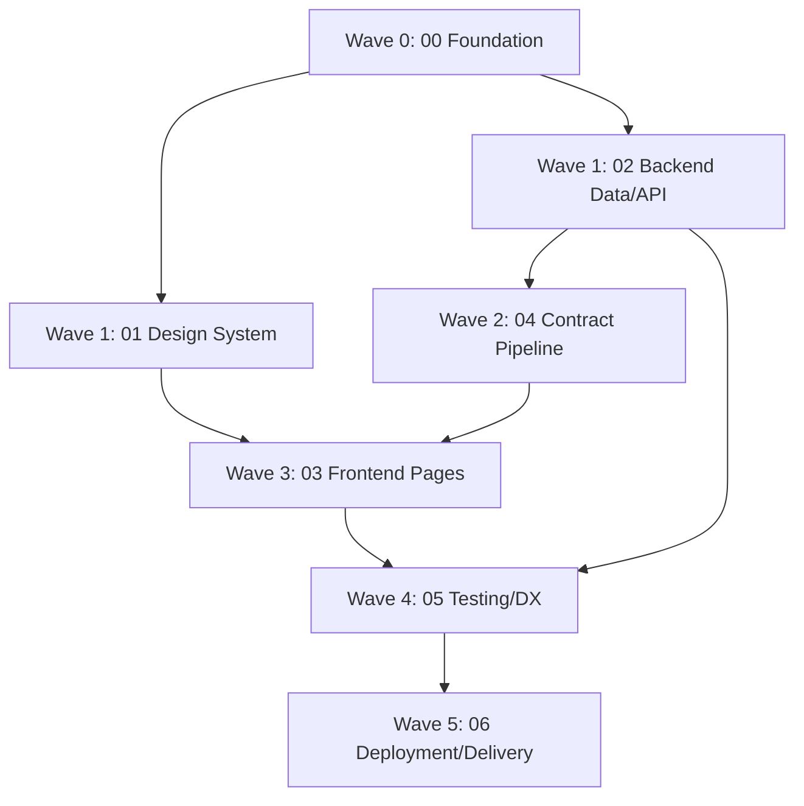

# Implementation Orchestration — Agent Tasks

This document maps each spec to a concrete, dispatchable **agent task**. It defines execution order (waves), dependencies, the exact prompt to give each agent, and the verification gate that must pass before the next wave starts.

> Rule for every agent: read `.specify/memory/constitution.md` first, then the spec folder's `spec.md` + `plan.md` + `tasks.md`. Treat the constitution's AVOID list as hard constraints. Tick off `tasks.md` checkboxes as you go. Do not hand-edit generated code.

---

## Dependency Graph & Execution Waves

| Wave | Agent task(s) | Can run in parallel? | Blocks on |
|---|---|---|---|
| 0 | T00 Foundation | single | nothing |
| 1 | T01 Design System, T02 Backend | yes (2 siblings) | T00 |
| 2 | T04 Contract Pipeline | single | T02 |
| 3 | T03 Frontend Pages | single | T01 + T04 |
| 4 | T05 Testing & DX | single | T02 + T03 |
| 5 | T06 Deployment & Delivery | single | all |

**Why this shape**: T01 (design system) and T02 (backend) touch disjoint packages and share no runtime state → safe to parallelize. Everything else is a coherent single-owner loop. The frontend (T03) cannot start until generated hooks exist (T04), which cannot exist until the backend OpenAPI surface exists (T02).

---

## Wave 0 — T00: Foundation & Monorepo

- **Spec**: [specs/00-foundation-monorepo](00-foundation-monorepo/spec.md)
- **Scope**: pnpm workspace + Turborepo skeleton, all package/app `package.json` + `tsconfig`, Docker Postgres, root scripts, ESLint/Prettier, `.env.example` files, README skeleton.
- **Depends on**: nothing.
- **Verification gate** (must pass before Wave 1):
  - `pnpm install` (no peer errors)
  - `pnpm lint` and `pnpm typecheck` (zero errors on empty stubs)
  - `pnpm db:up` then `pnpm dev:backend` → `GET /health` returns 200
  - `git status` shows no `.env`, no `packages/api-client/src/generated/`

**Agent prompt:**
> Implement spec 00 (Foundation & Monorepo) for the Odyssey restaurant dashboard at `/Users/spikedingo/odyssey-demo`. First read `.specify/memory/constitution.md`, then `specs/00-foundation-monorepo/{spec,plan,tasks}.md`. Create the full pnpm + Turborepo monorepo skeleton exactly as specified: `apps/dashboard` (Expo RN Web), `services/backend` (Hono on Cloudflare Workers), `packages/{shared,types,ui,api-client}`, plus root config (`turbo.json`, `tsconfig.base.json`, `.eslintrc`, `.prettierrc`, `.gitignore`, `pnpm-workspace.yaml`), `docker-compose.yml`, `.env.example` files, and a README skeleton. Each package gets a placeholder `src/index.ts` and proper workspace deps following the dependency direction in the constitution. The backend `src/index.ts` should be a minimal Hono app with a single `GET /health` route. Use `EXPO_PUBLIC_API_BASE_URL` (not VITE). Then run the verification gate from `specs/IMPLEMENTATION.md` Wave 0 and report results. Tick off `specs/00-foundation-monorepo/tasks.md` as you complete items. Do not implement any other spec.

---

## Wave 1 — T01: Design System & UI Library  *(parallel with T02)*

- **Spec**: [specs/01-design-system-ui-library](01-design-system-ui-library/spec.md)
- **Scope**: token files, Light/Dark theme + density contexts, all primitives (incl. `TextArea`, `Switch`, `WarningBanner`), the `/ui-library` showcase route.
- **Owns**: `packages/ui/**` and `apps/dashboard/src/app/ui-library.tsx` + `apps/dashboard/src/screens/UILibrary/**`.
- **Depends on**: T00.
- **Verification gate**:
  - `pnpm --filter=ui typecheck` and `pnpm --filter=ui build` (zero errors)
  - `pnpm dev:dashboard` → `/ui-library` renders all sections; theme + density toggles work live

**Agent prompt:**
> Implement spec 01 (Design System & UI Library) at `/Users/spikedingo/odyssey-demo`. Read `.specify/memory/constitution.md` then `specs/01-design-system-ui-library/{spec,plan,tasks}.md`. Build the full design system in `packages/ui`: token files (warm sage-green palette, warm-gray neutrals, semantic + order-status colors, Inter typography, 4px spacing grid, radii/borders/shadows), Light + Dark theme contexts with `useTheme()`, density context with `useDensity()`, and every primitive listed in the spec — including `TextArea`, `Switch`, and `WarningBanner`. Then build the `/ui-library` route in `apps/dashboard` showcasing tokens, typography, spacing, surfaces, and every component in all states, with live theme + density toggles. Use React Native StyleSheet (no Tailwind/CSS-in-JS) for web+native compatibility. This task may be internally parallelizable (tokens/theme vs components vs showcase screen) — split into internal workstreams if helpful. Run the Wave 1 / T01 verification gate and report. Tick off `tasks.md`. Do not touch backend or other pages.

---

## Wave 1 — T02: Backend Data Model & API  *(parallel with T01)*

- **Spec**: [specs/02-backend-data-api](02-backend-data-api/spec.md)
- **Scope**: Drizzle schema (6 tables), drizzle-zod validators (incl. `HomeSummarySchema`), service layer (order state machine, total verification, availability, home summary, delete policies), Hono+OpenAPI routes (incl. `GET /home/summary`), error middleware, seed script.
- **Owns**: `services/backend/**`.
- **Depends on**: T00.
- **Verification gate**:
  - `pnpm db:migrate` clean on fresh DB; `pnpm seed` succeeds and is idempotent
  - `GET /api/openapi.json` is valid OpenAPI 3.0 with all tags/operationIds
  - Business-rule checks: unavailable item → 422 `ITEM_UNAVAILABLE`; wrong total → 422 `TOTAL_MISMATCH`; invalid transition → 422 `INVALID_TRANSITION`; `pending→accepted` → 200
  - `GET /home/summary` returns all fields after seed; revenue excludes cancelled
  - `pnpm --filter=backend typecheck` zero errors

**Agent prompt:**
> Implement spec 02 (Backend Data Model & API) at `/Users/spikedingo/odyssey-demo`. Read `.specify/memory/constitution.md` then `specs/02-backend-data-api/{spec,plan,tasks}.md`. In `services/backend`: write the Drizzle schema for all 6 tables (settings, categories, menu_items, customers, orders, order_items) with money as integer cents and order_item name/price snapshots; generate + run migrations; write drizzle-zod validators including `HomeSummarySchema`; build the service layer with the canonical order state machine (`VALID_TRANSITIONS`), server-side total verification, availability checks, `homeService.getHomeSummary()` (today/yesterday counts + revenue excluding cancelled + popular items + recent_orders), and the documented menu/category delete policies; register all Hono routes with `@hono/zod-openapi` including `GET /home/summary`; add the `ApiError` class + `onError` middleware; write the idempotent seed script (3 categories, 12 menu items incl. 1 unavailable, 8 customers, 20 orders across all statuses and 30 days). Expose `/api/openapi.json`. This task may be internally parallelizable (schema/validators vs services vs routes vs seed) — split internally if helpful. Run the Wave 1 / T02 verification gate and report. Tick off `tasks.md`. Do not touch frontend or `packages/ui`.

---

## Wave 2 — T04: Contract Generation Pipeline

- **Spec**: [specs/04-contract-pipeline](04-contract-pipeline/spec.md)
- **Scope**: `packages/types` shared constants, backend OpenAPI export script, Orval config + custom fetch, `gen:contract` wiring, generated hooks/types verification.
- **Owns**: `packages/types/**`, `packages/api-client/{orval.config.ts,src/customFetch.ts,src/index.ts}`, backend `src/openapi-export.ts`, root `gen:contract` script.
- **Depends on**: T02 (needs the OpenAPI surface).
- **Verification gate**:
  - `pnpm gen:contract` completes end-to-end and is idempotent
  - `packages/api-client/src/generated/` populated; `OrderDetail.status` typed as 7-value union
  - expected hooks exist (`useListOrders`, `useCreateOrder`, `useUpdateOrderStatus`, `useGetHomeSummary`, …)
  - `pnpm --filter=api-client typecheck` zero errors

**Agent prompt:**
> Implement spec 04 (Contract Generation Pipeline) at `/Users/spikedingo/odyssey-demo`. Read `.specify/memory/constitution.md` then `specs/04-contract-pipeline/{spec,plan,tasks}.md`. Write `packages/types/src/index.ts` (`OrderStatus`, `ORDER_STATUS_LABELS`, `VALID_TRANSITIONS`, `DensityLevel`). Add `services/backend/src/openapi-export.ts` that writes `openapi.json` to the workspace root via `getOpenAPIDocument()`, plus the backend `build:openapi` script. Configure Orval in `packages/api-client` (tags-split, react-query, fetch, custom mutator reading `EXPO_PUBLIC_API_BASE_URL`), write the hand-maintained `customFetch.ts` + `index.ts` barrel, and gitignore `src/generated/`. Wire the root `gen:contract` script (build:openapi → orval → typecheck). Run it end-to-end, verify the generated hooks/types per the Wave 2 / T04 gate, and report. Tick off `tasks.md`. Backend route shapes are owned by T02 — if the OpenAPI surface is missing an operation you need, report it rather than editing backend business logic.

---

## Wave 3 — T03: Frontend Pages

- **Spec**: [specs/03-frontend-pages](03-frontend-pages/spec.md)
- **Scope**: app shell (providers + Sidebar), all 5 pages (Home/Orders/CRM/Menu/Settings) + detail routes, Drawer/Modal flows, URL-synced Orders filters, empty/error/loading states, hooks + utils.
- **Owns**: `apps/dashboard/src/app/(dashboard)/**`, `apps/dashboard/src/screens/**` (except UILibrary), `apps/dashboard/src/hooks/**`, `apps/dashboard/src/utils/**`.
- **Depends on**: T01 (UI primitives) + T04 (generated hooks).
- **Verification gate**:
  - `pnpm dev:dashboard` → all 5 pages load against the real backend
  - Orders status filter syncs to URL and survives refresh
  - create order → success toast + redirect; `pending→accepted` updates badge
  - Home uses a single `useGetHomeSummary()` (no separate list call); `recent_orders` powers the table
  - `pnpm --filter=dashboard typecheck` zero errors

**Agent prompt:**
> Implement spec 03 (Frontend Pages) at `/Users/spikedingo/odyssey-demo`. Read `.specify/memory/constitution.md` then `specs/03-frontend-pages/{spec,plan,tasks}.md`. Build the Expo Router app shell (`_layout` providers stack + Sidebar), the five pages and their detail routes (Home, Orders + `[id]`, CRM + `[id]`, Menu, Settings), using ONLY generated hooks from `packages/api-client` and primitives from `packages/ui`. Implement the mixed Drawer/Modal flows (New Order Drawer with customer + item selectors and running subtotal; Menu item Drawer; confirmation Modals for status actions and deletes), URL-synced Orders filters via `useLocalSearchParams`, and thorough empty/error/loading states everywhere. Keep business logic in `hooks/` and `utils/` (e.g. `getAvailableActions` from `@odyssey/types`), pages thin. Home must use a single `useGetHomeSummary()` and render `recent_orders` from it. Run the Wave 3 / T03 verification gate (backend must be running + seeded) and report. Tick off `tasks.md`. Do not hand-write API DTOs and do not edit `packages/api-client/src/generated`.

---

## Wave 4 — T05: Testing & DX

- **Spec**: [specs/05-testing-dx](05-testing-dx/spec.md)
- **Scope**: backend Vitest (order creation, state transitions, validators, home summary) against a test DB; frontend Jest (orderStatus + currency utils, Badge + EmptyState components); DX scripts.
- **Owns**: `services/backend/src/__tests__/**`, `apps/dashboard/src/__tests__/**`, `packages/ui/src/__tests__/**`, test configs, `test:*` scripts.
- **Depends on**: T02 + T03.
- **Verification gate**:
  - `pnpm db:setup-test` + `pnpm test:backend` passes (all valid/invalid transitions, ITEM_UNAVAILABLE, TOTAL_MISMATCH, price snapshot, home revenue excludes cancelled)
  - `pnpm test:frontend` passes
  - `pnpm test` green from root

**Agent prompt:**
> Implement spec 05 (Testing & DX) at `/Users/spikedingo/odyssey-demo`. Read `.specify/memory/constitution.md` then `specs/05-testing-dx/{spec,plan,tasks}.md`. Set up the backend Vitest harness against an `odyssey_test` database (setup file with migrate + per-test truncate, factories) and write the targeted suites: order creation (valid, unavailable→ITEM_UNAVAILABLE, missing→ITEM_NOT_FOUND, wrong total→TOTAL_MISMATCH, price snapshot, walk-in), all 8 valid + 6 invalid state transitions, Zod validators, and home summary (revenue excludes cancelled, recent_orders ordering). Set up frontend Jest (jest-expo + testing-library) and write the utility tests (`getAvailableActions`, `formatCents`) and component tests (`Badge`, `EmptyState`). Add `test:backend`/`test:frontend` scripts. Run the Wave 4 / T05 verification gate and report. Tick off `tasks.md`.

---

## Wave 5 — T06: Deployment & Delivery

- **Spec**: [specs/06-deployment-delivery](06-deployment-delivery/spec.md)
- **Scope**: `wrangler.toml` prod config, deploy scripts, `.env.deploy.example`, complete root README (overview, stack, architecture diagram, quick-start, scripts table, ADRs, evaluation-criteria mapping, tradeoffs), dry-run verification of the README.
- **Owns**: root `README.md`, deploy scripts, `wrangler.toml`, `.env.deploy.example`.
- **Depends on**: all prior waves (documents the finished system).
- **Verification gate**:
  - Following the README quick-start from a clean state starts both servers + opens the dashboard
  - `git status` clean of secrets/generated artifacts; `pnpm lint`, `pnpm typecheck`, `pnpm test` all green

**Agent prompt:**
> Implement spec 06 (Deployment & Delivery) at `/Users/spikedingo/odyssey-demo`. Read `.specify/memory/constitution.md` then `specs/06-deployment-delivery/{spec,plan,tasks}.md`. Finalize `services/backend/wrangler.toml` (prod env, nodejs_compat, no secrets), add the `deploy:backend`/`deploy:frontend`/`deploy` scripts and `export` script, and `.env.deploy.example`. Write the complete root `README.md` covering project overview, stack, the contract-pipeline architecture diagram, the `packages/ui` structure note, prerequisites, the exact local quick-start, a scripts reference table, the 6 ADRs (summarized + linked), the evaluation-criteria↔specs mapping, and the known-tradeoffs table. Then do a dry-run of the README quick-start from a clean state, fix any inaccuracies, and run the Wave 5 / T06 verification gate. Tick off `tasks.md`.

---

## Coordinator Notes

- **Hand-offs**: After each wave's verification gate passes, the next wave's agent can start. Waves 1a/1b (T01/T02) are the only siblings; launch them together.
- **Cross-task contract**: T03 consumes T04's generated hooks and T01's primitives. If T03 finds a missing hook, the fix belongs in T02 (route/schema) + re-run T04 — not a handwritten DTO in the frontend.
- **Shared sync rule**: any change to order statuses must update Drizzle `pgEnum` (T02), `packages/types` (T04), and backend `VALID_TRANSITIONS` (T02) together, then re-run `gen:contract`.
- **Scope discipline (timebox)**: if time runs short, the safe-to-defer items are dark theme polish, density switching, and KPI trend arrows — core flows (5 pages + order lifecycle + contract pipeline + key tests) take priority.
